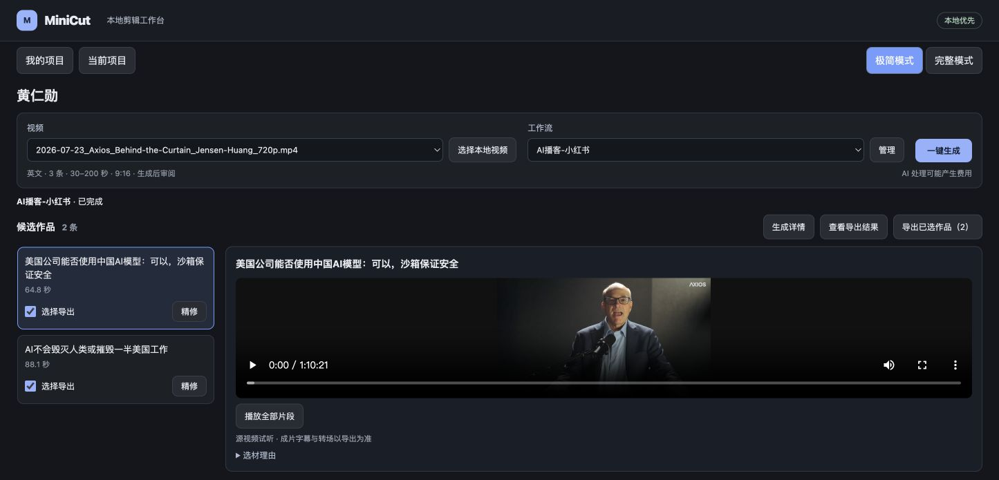
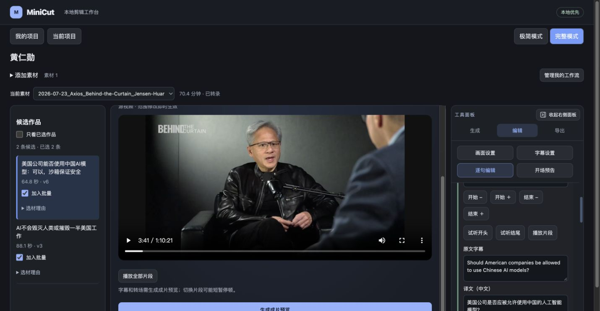
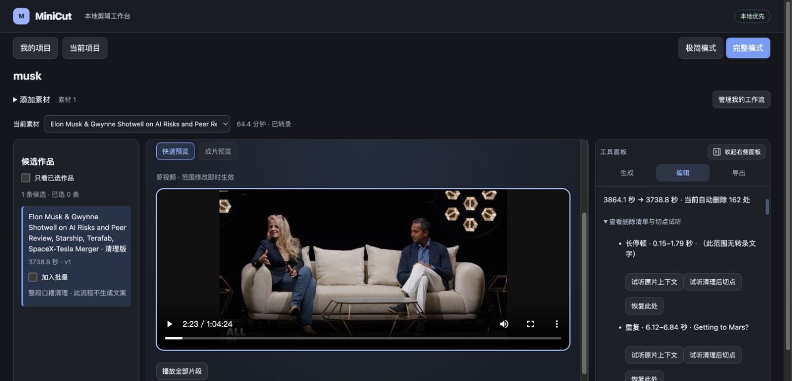

<h1 align="center">MiniCut</h1>

<p align="center">
  <strong>把长讲话视频变成精选短片，或清理成更流畅的完整口播。</strong>
</p>

<p align="center">
  本地优先 · AI 辅助剪辑 · 人工审阅 · 本地导出
</p>

<p align="center">
  <a href="#快速开始">快速开始</a> ·
  <a href="#两种处理方式">处理方式</a> ·
  <a href="#使用指南">使用指南</a> ·
  <a href="#开发">开发</a>
</p>

MiniCut 是面向讲座、教程、访谈、播客和口播的视频剪辑工作台。导入长视频，由本地 Whisper 转录、LLM 按要求进行剪辑，人工通过试听和编辑决定最终成片。



> **导入视频 → 本地转录 → 精选片段／口播清理 → 人工精修 → 导出**

视频处理与导出在本地完成。选材、口播清理和字幕翻译会将转录文本发送至配置的模型服务。

## 两种处理方式

| | 精选片段 | 口播清理 |
| --- | --- | --- |
| **你想做什么** | 从长视频中精选出适合独立观看的内容 | 保留整段内容，并让讲话更流畅 |
| **如何处理** | 按主题和要求选择原文片段 | 删除明确口误、失败起句、机械重复和无意义填充词，并压缩长停顿 |
| **如何审阅** | 试听候选、调整起止范围、校正字幕，检查或添加开场预告 | 查看删减类别、试听原片上下文和清理后切点 |
| **得到什么** | 多条可编辑的精选作品 | 一条可编辑的完整清理版 |

精选适合拆出访谈问答、课程知识点或主题短片；清理适合整理一次完整的口播、教程或演讲。两种流程都保留原声，支持后续字幕、封面和视频导出。

<details>
<summary><strong>查看完整模式编辑界面</strong></summary>



</details>

<details>
<summary><strong>查看口播清理审阅界面</strong></summary>



</details>

## 核心能力

- **本地词级转录**：支持中文与英文，使用 MLX / PyTorch Whisper；长素材分块保存进度，失败后可恢复并复用缓存。
- **从原话中剪辑**：模型引用转录中的来源 ID，由本地程序解析并校验时间范围；默认连续正文保留起止点之间的停顿和重复，主动选择精简拼接才允许跳切。
- **边听边改**：快速预览直接播放源素材；调整范围、删减与恢复、修改字幕，并保留作品历史版本。保存编辑后，显式生成成片预览或导出才渲染视频。
- **字幕与画面一起调整**：中英字幕翻译、双语显示、软字幕或烧录字幕；支持横屏、竖屏、方形画幅和自定义裁剪。
- **导出完整素材包**：单条或批量导出 MP4、SRT 和封面。精选作品可附标题与发布文案；口播清理不生成发布文案。
- **复用常用工作流**：组合转录、生成、字幕、画面和封面配置；极简模式支持一键生成及可选自动导出，任务可取消和恢复。

## 快速开始

目前从源码启动，需要分别运行后端和前端。先获取源码，后续命令从仓库根目录执行。

**准备环境**：Python 3.11+、[uv](https://docs.astral.sh/uv/getting-started/installation/)、[Node.js](https://nodejs.org/en/download) 22.12+ 和 npm，以及可从终端调用的 [FFmpeg / ffprobe](https://ffmpeg.org/download.html)。FFmpeg 需包含 `libx264`；烧录字幕还需 libass 和中文字体。

### 1. 安装依赖

```bash
git clone https://github.com/ben0724-ACE/mini-cut.git
cd mini-cut
uv sync --python 3.11
cd web
npm ci
cd ..
```

根据机器选择一个转录后端：

<details open>
<summary><strong>macOS · Apple Silicon</strong></summary>

```bash
uv pip install mlx-whisper
```

新任务默认使用 MLX / large-v3-turbo。

</details>

<details>
<summary><strong>Windows / Linux / Intel Mac</strong></summary>

```bash
uv pip install openai-whisper
```

新任务默认使用 PyTorch Whisper / small。Windows 与 Linux 的兼容目标为 Python 3.11、CPU 转录；CPU 安装方式、字体配置和平台验证说明见[安装补充](docs/user-guide.md#windows-与-linux-安装补充)。已有任务与工作流保留原来的引擎和模型。

</details>

### 2. 配置模型服务

初次使用时，复制 `.env.example` 为 `.env`。已有 `.env` 时直接编辑，保留现有配置。

AI 精选、口播清理和字幕翻译需要配置模型服务：

```dotenv
DEEPSEEK_API_KEY=你的密钥
```

可通过 `DEEPSEEK_MODEL` 和 `DEEPSEEK_BASE_URL` 调整模型及兼容接口地址。仅本地转录、编辑和渲染无需 API 密钥。

### 3. 启动工作台

**终端一：后端**

macOS / Linux：

```bash
MINICUT_PROJECTS_ROOT="$PWD/projects" \
uv run --no-sync --env-file .env minicut-api
```

<details>
<summary><strong>Windows PowerShell 启动命令</strong></summary>

```powershell
$env:MINICUT_PROJECTS_ROOT = Join-Path $PWD.Path "projects"
uv run --no-sync --env-file .env minicut-api
```

若 PowerShell 执行策略阻止 `npm`，可使用 `npm.cmd`。

</details>

**终端二：前端**

```bash
cd web
npm run dev -- --host 127.0.0.1
```

打开 **[MiniCut 工作台](http://127.0.0.1:5173)**。本地 API 文档位于 [127.0.0.1:8000/docs](http://127.0.0.1:8000/docs)。

首次转录可能下载模型。启动命令中的 `--no-sync` 用于保留单独安装的转录依赖；更新基础依赖时使用 `uv sync --inexact`。保持两个终端运行，同一个项目根目录只启动一个 API 进程。

### 4. 完成第一条作品

1. 创建项目，导入本地讲话视频，选择实际源语言并完成转录。
2. 选择「精选片段」生成候选，或选择「口播清理」处理整段素材。
3. 试听结果、调整范围并保存，再校正字幕。范围变更会重置受影响的字幕校正与翻译。
4. 生成成片预览，核对字幕、画面与切点，然后导出视频、字幕和封面。

日常重复处理时，可将常用配置保存为「我的工作流」，在**极简模式**中一键运行。

## 数据与模型调用

| 内容 | 在哪里处理或保存 |
| --- | --- |
| 原视频、转录、作品版本、预览与导出 | 本地项目目录，由 `MINICUT_PROJECTS_ROOT` 指定 |
| 设置、预设、工作流、封面与模型请求记录 | 本地 JSON / SQLite 文件 |
| 转录模型 | 首次使用可能下载，后续复用本机缓存 |
| AI 选材、口播清理、字幕翻译 | 将转录文本发送至配置的模型服务 |

模型请求可能产生费用，长视频可能需要多次调用；费用估算取决于服务返回的用量和配置的价格，未配置价格或缺失用量不代表免费。导出与导出恢复不重新调用模型。自动导出仅生成本地文件，不发布到外部平台。

## 使用指南

| 想了解什么 | 文档 |
| --- | --- |
| 平台安装、字体、模型缓存与端口配置 | [安装与运行](docs/user-guide.md#安装与运行) · [Windows / Linux 补充](docs/user-guide.md#windows-与-linux-安装补充) |
| 极简模式与可复用配置 | [极简模式与我的工作流](docs/user-guide.md#极简模式与我的工作流) |
| 词级转录、模型选择与缓存恢复 | [导入与转录](docs/user-guide.md#导入与转录) |
| AI 选材、开场预告与字幕翻译 | [生成精选](docs/user-guide.md#生成精选) |
| 整段口播的删减、试听与恢复 | [口播清理](docs/user-guide.md#口播清理) |
| 范围修改、字幕校正与成片预览 | [预览与编辑](docs/user-guide.md#预览编辑与开场预告) |
| 视频、字幕、封面与批量处理 | [导出](docs/user-guide.md#导出) · [封面设计](docs/user-guide.md#封面设计) |
| 中断任务与磁盘空间管理 | [取消与恢复](docs/user-guide.md#取消与恢复) · [存储与清理](docs/user-guide.md#存储与清理) |

## 使用边界

转录和剪辑建议需要人工试听，尤其是否定词、专有名词、必要背景和切点。MiniCut 不提供自动人物追踪、B-roll、配乐或旁白生成。快速预览播放源素材，最终字幕排版和画面效果请通过成片预览检查；导出前需要保存草稿。

默认服务面向本机使用，没有面向公网的账户与权限系统。项目文件会随转录、预览和导出累积，不会自动清理；删除项目会永久移除其中的数据，请先保留需要的文件。

关闭或刷新页面不会中断后台任务；停止后端后，需要在重启后显式继续任务，详见[取消与恢复](docs/user-guide.md#取消与恢复)。

## 开发

前端使用 **React / TypeScript / Vite**，后端使用 **FastAPI / Python**；本地转录使用 **MLX Whisper / PyTorch Whisper**，媒体处理使用 **FFmpeg / ffprobe / Pillow**。

```text
src/minicut/   领域模型、API、CLI、转录、AI 编排与渲染
web/src/       React 工作台与组件测试
tests/         Python 单元测试与真实媒体集成测试
tools/         开发检查工具
```

从仓库根目录运行开发检查：

```bash
uv sync --inexact
uv run --no-sync python tools/check.py
cd web
npm ci
npm test
npm run build
```

后端检查包含 pytest、Ruff 和 Pyright；前端检查包含组件测试、TypeScript 和生产构建。媒体集成测试会实际运行 FFmpeg。CLI 命令可通过 `uv run --no-sync minicut --help` 查看。提交遵循 Conventional Commits，请勿提交密钥、模型、测试视频或生成文件。

Web 精选使用 `OutputPlan`；`EditPlan` 保留用于 CLI 和旧审阅流程，详见[数据模型与兼容性](docs/user-guide.md#剪辑数据模型与兼容性)。

## 许可证

项目代码采用 [MIT License](LICENSE)。第三方依赖和转录模型遵循各自许可证；内置转场素材来源见 [SOURCES.txt](src/minicut/assets/SOURCES.txt)。导入视频的使用与发布需具备相应授权。
